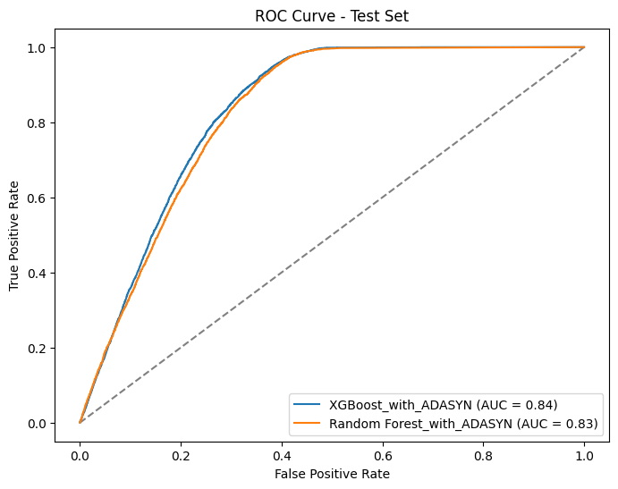
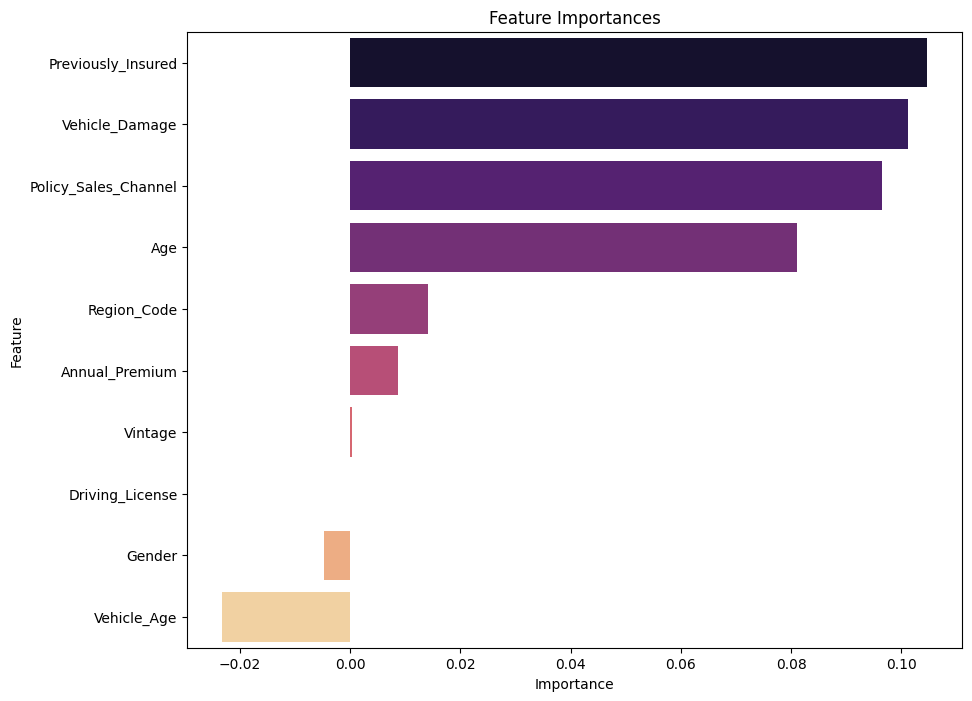

# Health-Insurance Prediction and Explainability

1. [Introduction](#introduction)
2. [Dataset](#dataset)
   * [Kaggle](#kaggle)
   * [Description](#description)
3. [Methods and Results](#methods)
   * [EDA](#eda)
   * [Machine Learning models](#machine-learning-models)
       * [Models without oversampling](#models-without-oversampling)
       * [Models with ADASYN](#models-with-ADASYN)
   * [Explainability with ELI5](#explainability-with-ELI5)
4. [References](#references)

## Introduction

The goal of this project is not to find perfect performance, but to reach a satisfactory benchmark level in line with other projects proposed on Kaggle. Using machine learning and explainability techniques, we analyze demographic, vehicle and policy data to develop models that predict interest in vehicle insurance with high accuracy. Additionally, we add an explainability section with ELI5 to help both customers and companies in business decision making by providing insights into the factors that influence these decisions. This can help insurance companies improve their strategies to increase adoption rates and ensure more comprehensive coverage.

Vehicle insurance plays a critical role in safeguarding individuals against financial losses stemming from accidents, thefts, and other vehicle-related damages. By providing coverage for repair costs, medical expenses, and liability, vehicle insurance helps mitigate the economic impact of unforeseen events. 

According to Insurance Research Council (IRC) [[1](#ref1)][[2](#ref2)], 14 Percent of U.S. Drivers Were Uninsured in 2022.

Several factors contribute to this situation [[3](#ref3)], including:

- Lack of Awareness.
- Financial Constraints.
- Low Perceived Value.

## Dataset

### Kaggle

The dataset for this project was taken from Kaggle: https://www.kaggle.com/datasets/anmolkumar/health-insurance-cross-sell-prediction/data

### Description

Key observations:

- Age: Skewed towards younger ages.
- Annual Premium: Positively skewed with most values concentrated at the lower end.
- Region Code: Relatively uniform distribution.
- Vintage: Nearly uniform distribution.
- Policy Sales Channel: Certain channels are used more frequently.

## Methods and Results

### EDA

Regarding the EDA methods, I analyzed the distribution of numerical features, finding a positive skew for Annual Premium and a skewed distribution for Age. I observed how categorical features varied in relation to the target feature "Response," highlighting a significant imbalance in the dataset for class 0 (as expected for cases of this nature).

After encoding the categorical features, I checked for obvious correlations between features (except for Age and Vehicle Age, which was expected).

I performed outlier detection and removal on the Annual Premium feature using Isolation Forest, which visually suggested potential outliers. Given the large dataset, I wanted to use a more sophisticated method to identify outliers. I also tried the IQR method, but it was too strict, removing many data points. I opted for a less strict approach (with a contamination rate of 0.01) because I wasn't entirely convinced that removing too many points was necessary; the input of a domain expert would have been helpful. Applying a logistic transformation would have significantly improved the point distribution. In the end, I removed only 3,798 out of over 380,000 data points.

For purely informational and visual purposes, I conducted a PCA analysis to determine how many components were needed to explain 90% of the variance, finding that six principal components were sufficient.

Finally, I applied PCA to K-means clustering to see how the data points grouped into clusters (K found using the Elbow method) using two principal components. This analysis was intended to provide insights for potential future use cases with the test dataset, which did not include the target column.

### Machine Learning models

#### Models without oversampling

The Kaggle project required evaluating the model on the [training dataset](Data/train.csv)  by calculating the area under the curve (AUC) and visualizing the ROC curve.

As an initial analysis, I split this dataset into a training set (90%) and a test set (10%). I conducted a RandomizedSearchCV for two ensemble models (robust for datasets without preprocessing and scaling) such as Random Forest and XGBoost. This technique was preferred as it didn't require excessive computational time, and performance was compared using the F1 score due to the imbalanced dataset. The performance was very good in terms of accuracy and AUC (as expected), but the models showed poor performance in metrics such as precision, recall, and F1 score, highlighting the issues of an imbalanced dataset. Specifically, performance dropped significantly on the 10% test set.

Here are some of the results:

| Set       | Model          | Accuracy | Precision | Recall  | F1 Score | AUC      |
|-----------|----------------|----------|-----------|---------|----------|----------|
| Train     | XGBoost        | 0.878245 | 0.661191  | 0.007764| 0.015348 | 0.862489 |
|           | Random Forest  | 0.999856 | 0.999735  | 0.999084| 0.999409 | 1.000000 |
| Test      | XGBoost        | 0.877231 | 0.671642  | 0.009673| 0.019072 | 0.860275 |
|           | Random Forest  | 0.865986 | 0.364252  | 0.115649| 0.175559 | 0.832948 |

#### Models with ADASYN

Next, I immediately applied an oversampling technique, ADASYN. I chose this approach because I wanted a strategy that focused more on the complex data within the dataset. I performed the same procedures for searching for the best hyperparameters and evaluating the two models on both the new training dataset and the same 10% test set. The performances did not improve as much as I had hoped, demonstrating the difficulty of finding truly perfect patterns for such a large dataset. However, I managed to achieve significantly better results on the test set compared to the case without resampling and to quantitatively improve the XGBoost model.

The latter proved to be much more stable and robust in performance between the training and test sets compared to the Random Forest, as indicated by the results and graphs, achieving an AUC of 84% (consistent with the results observed on Kaggle).

| Set  | Model                  | Accuracy | Precision | Recall   | F1 Score | AUC     |
|------|------------------------|----------|-----------|----------|----------|---------|
| Train| XGBoost_with_ADASYN    | 0.861888 | 0.834770  | 0.908074 | 0.869880 | 0.949225|
|      | Random Forest_with_ADASYN | 0.992461 | 0.992227  | 0.992949 | 0.992588 | 0.999782|
| Test | XGBoost_with_ADASYN    | 0.789948 | 0.319647  | 0.622528 | 0.422404 | 0.835450|
|      | Random Forest_with_ADASYN | 0.814693 | 0.315881  | 0.430567 | 0.364414 | 0.827877|

### Explainability with ELI5

Finally, I decided to incorporate an explanation section using ELI5 [[4](#ref4)], short for "Explain Like I'm 5". This is a Python library that provides tools for debugging machine learning models and explaining their predictions. It offers various methods for interpreting and understanding how a machine learning model works and why it makes certain predictions. ELI5 is model-agnostic, supporting all scikit-learn algorithms to explain both white-box models (such as Decision Trees) and black-box models (such as Keras with GRADCAM, XGBoost). It allows for regression and classification analysis, providing both global and local explanations.

Analyzing a black box model like XGBoost, I performed a permutation model by calculating the importance of features by observing how much the score (accuracy, F1, R^2) decreases when a feature is not available.

For each feature:

1. Shuffle values in the provided dataset.
2. Generate predictions using the model on the modified dataset.
3. Compute the decrease in accuracy compared to before shuffling.
4. Compare the impact on accuracy of shuffling each feature individually.

A feature is considered "important" if shuffling its values increases the model error, indicating that the model relied on the feature for the prediction. Conversely, a feature is deemed "unimportant" if shuffling its values leaves the model error unchanged, suggesting that the model ignored the feature for the prediction. This process is repeated several times.

This is the feature importance plot for global explanation:

As we can see, there are some interesting information XGBoost gave us from this explainability analysis. Previously Insured is the most important factor in determining whether a customer may want to purchase health insurance in the future. This is valuable information to provide to the company, as well as the third position occupied by Policy_Sales_Channel, highlighting the importance of the contact channel with the customer, e.g., agents, mail, telephone, in-person, etc. Surprisingly, the last place is held by the age of the vehicle, which clearly differs from the age of the customer.

In [ELI% notebool](ELI5_explainability.ipynb), you can find also some plots about local explanation on single observation. This could be useful because it shows how for single subject the feature importance could change.

## References

1.  https://www.insurance-research.org/research-publications/uninsured-motorists-2
2.  https://www.businesswire.com/news/home/20231031282136/en/14-Percent-of-U.S.-Drivers-Were-Uninsured-in-2022-IRC-Estimates
3.  https://www.opportunityinstitute.org/blog/post/why-you-cant-buy-health-insurance-like-auto-insurance/
4.  https://github.com/TeamHG-Memex/eli5/

